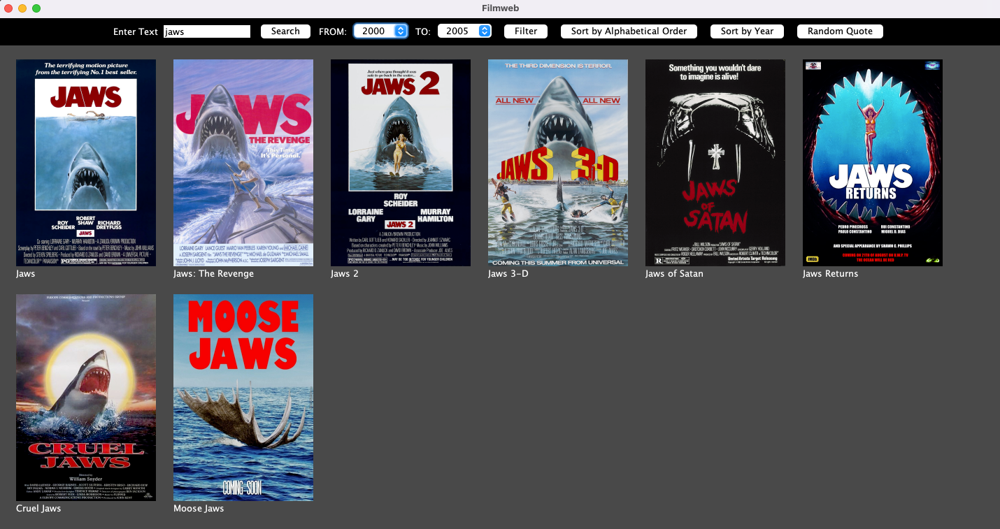
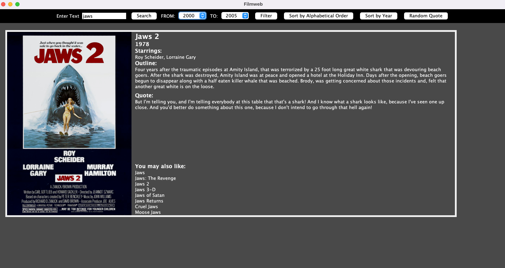
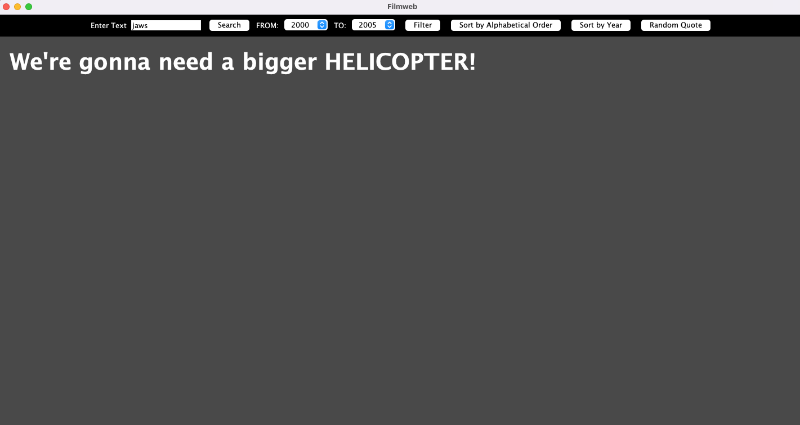

# Filmweb vol. 2
<!-- https://github.com/othneildrew/Best-README-Template -->
<!-- TABLE OF CONTENTS -->

  
<h2 style="display: inline-block">Table of Contents</h2>

  <ol>
    <li>
      <a href="#about-the-project">About The Project</a>
    </li>
    <li><a href="#usage">Usage</a></li>
    <li><a href="#contact">Contact</a></li>
  </ol>

<!-- ABOUT THE PROJECT -->
## About The Project

This project was created as the final submission for course Advanced Objective Programming (Zaawansowane programowanie obiektowe i funkcyjne). Created by Natalia Safiejko and Zuzanna Piróg. The application is an alternative movie and series search engine that uses REST API queries.

<!-- USAGE EXAMPLES -->
## Usage

### Main Page

After launching the app we will be given a single text box to search for preffered movie or TV series. After clicking search button the corresponding results will appear. We can filter those results by limiting them to those that were produced in a chosen time period. We can also sort them by alphabetical order or by the year they were produced.

### Detail Panel

After clicking on a movie poster we are directed to a new panel which shows details of chosen movie as well as a random quote from that movie if data is provided. We are also given recommendations at the bottom which we can search by copying them to the search box.

### Quote generator

After searching movies we can also click generate quote button which will show us random quote form searched movie list.

<!-- CONTACT -->
## Contact

Zuzanna Piróg - [GitHub](https://github.com/zuzanna56)

Natalia Safiejko - [GitHub](https://github.com/ssafiejko)

